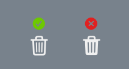

# HalfModal

SwiftUI package for displaying custom iOS 13 like modal.


It supports:
* drag gesture
* partial and full size modal
* light and dark mode
* iOS 13 like buttons

### Installation:
Requirements: iOS 13 or later, Xcode 11 or later.

Simplest way to install is to use Swift Package Manager.
In Xcode go to `File -> Swift Packages -> Add Package Dependency` and paste in the repo's url: `https://github.com/ViktorMaric/HalfModal`

### Usage:
Import HalfModal to your project: `import HalfModal`

You can put any content you want inside a modal.

HalfModal example:
```swift
 ZStack {
     Button(action: {
         withAnimation {
             self.showingHalfModal = true
         }
     }, label: {
         Text("Show HalfModalView")
     })
     
     if showingHalfModal {
         HalfModalView(content: AnyView(Text("content")), header: AnyView(Text("Header")), isPresented: $showingHalfModal)
     }
 }
```
Pass HalfModalContent() View to the content parameter to get iOS 13 like buttons.
```swift
  ZStack {

        Button(action: {
            withAnimation {
                self.showingHalfModal = true
            }
        }, label: {
            Text("Show HalfModalView")
        })

        if showingHalfModal {
            HalfModalView(content: AnyView(HalfModalContent(priorButtons: [AnyView(
            Button(action: {
                withAnimation {
                    self.showingHalfModal = false
                }
            }, label: {
                ModalButtonView(title: "Copy", image: Image(systemName: "doc.on.doc"), labelColor: .primary)
            })),
            AnyView(Button(action: {
                withAnimation {
                    self.showingHalfModal = false
                }
            }, label: {
                ModalButtonView(title: "Share", image: Image(systemName: "square.and.arrow.up"), labelColor: .primary)
            }))
            ], secondaryButtons: [
            AnyView(Button(action: {
                withAnimation {
                    self.showingHalfModal = false
                }
            }, label: {
                ModalButtonView(title: "Information", image: Image(systemName: "info.circle"), labelColor: .primary)
            })),
            AnyView(Button(action: {
                withAnimation {
                    self.showingHalfModal = false
                }
            }, label: {
                ModalButtonView(title: "Love", image: Image(systemName: "heart"), labelColor: .primary)
            })),
            AnyView(Button(action: {
                withAnimation {
                    self.showingHalfModal = false
                }
                }, label: {
                ModalButtonView(title: "Dislike", image: Image(systemName: "hand.thumbsdown"), labelColor: .primary)
            }))])), header: AnyView(Text("Header")), isPresented: self.$showingHalfModal)
        }
    }
```

### UI & UX guide:
Best practice:
* Use HalfModal if you would like to show more than three button. If you would like to show 3 or less buttons then the built in ActionSheet might be a better option.
* Use HalfModalContent() to show iOS 13 like buttons which are familiar to the iOS users.

Show the most frequently used buttons at the top.


Avoid using filled shapes.


